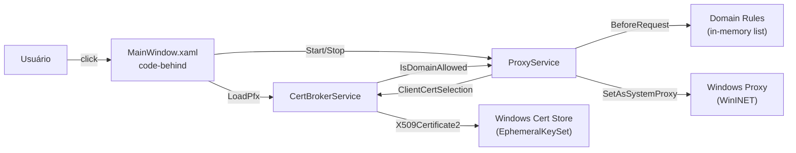
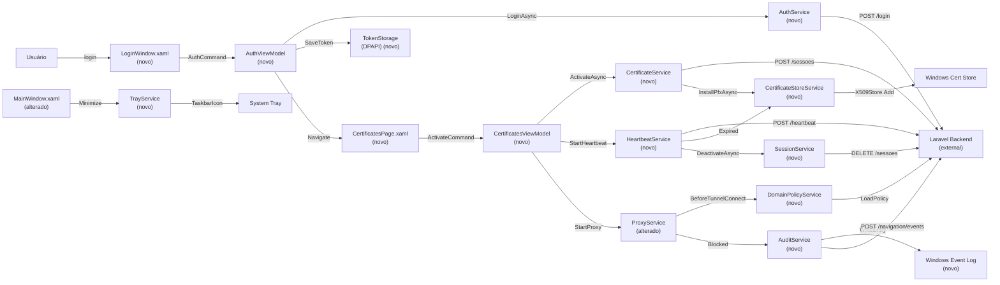

# Implementation Plan

## Request Summary
- Objective: Migrate CertGuard Desktop from the current single-project code-behind WPF prototype (CertGuardMini) to a multi-project .NET 8 WPF solution with MVVM architecture, Laravel backend integration, MITM proxy with domain policy, and audit logging.
- Scope: in — Multi-project solution (Core, Services, Desktop), MVVM with CommunityToolkit.Mvvm, DI, Laravel backend integration (auth/certs/sessions/devices/policy), DPAPI token persistence, Titanium.Web.Proxy MITM, wildcard domain matching, X509Store cert install/remove, HeartbeatService BackgroundService, Windows Event Log audit, backend audit sync, system tray (Hardcodet), pt-BR UI. out — API Hooking (C++ N-API addon), SACL, Sysmon, CNG ETW, Detours/Hooks project, E2E test suite, production cert deployment, Firefox proxy config, multi-user, dashboard/Filament UI.
- Tier: complete
- Architecture references: AGENTS.md, docs/agents/architecture.md, docs/agents/tech_stack.md, docs/agents/domain_rules.md, docs/agents/api_contracts.md, docs/agents/data_model.md, docs/agents/dependencies.md, docs/agents/coding_guidelines.md

## AS IS — Componentes impactados

**Legenda:** Diagrama de fluxo do estado atual do CertGuardMini. O usuário interage diretamente com MainWindow (code-behind), que orquestra CertBrokerService para carregamento de certificados e ProxyService para interceptação MITM. As regras de domínio são avaliadas em memória. Não existe integração com backend, MVVM, nem persistência de dados.

## TO BE — Componentes propostos

**Legenda:** Diagrama de fluxo do estado proposto. A aplicação migra para MVVM com CommunityToolkit.Mvvm (T04-T06). O login autentica contra o backend Laravel via AuthService e armazena o token com DPAPI (T07-T08). A lista de certificados é exibida a partir da API com ativação/desativação (T09-T11). O heartbeat roda como BackgroundService com limpeza automática na expiração (T12-T13). O proxy MITM intercepta HTTPS, bloqueia domínios não autorizados e injeta client certificates (T14-T16). A política de domínios suporta wildcard matching (T17). Os eventos de auditoria são logados no Windows Event Log e sincronizados com o backend (T18). A integração com system tray implementa minimização para a bandeja (T19).

## Tasks

### T01 — Create solution and project structure
- **Files**: `CertGuard.sln`, `src/CertGuard.Core/CertGuard.Core.csproj`, `src/CertGuard.Services/CertGuard.Services.csproj`, `src/CertGuard.Desktop/CertGuard.Desktop.csproj`
- **Change**: Create the new multi-project solution with three projects: Core (classlib, net8.0), Services (classlib, net8.0), Desktop (wpf, net8.0-windows). Add inter-project references: Services → Core, Desktop → Services + Core.
- **Covers**: RF-01
- **Tests**: `dotnet build` from solution root completes with zero errors.
- **Risk**: Low — structural change only, no business logic.
- **Dependencies**: none

### T02 — Install NuGet packages
- **Files**: `src/CertGuard.Core/CertGuard.Core.csproj`, `src/CertGuard.Services/CertGuard.Services.csproj`, `src/CertGuard.Desktop/CertGuard.Desktop.csproj`
- **Change**: Add NuGet packages per project: Core → `System.Security.Cryptography.ProtectedData`; Services → `Microsoft.Extensions.Http`, `Microsoft.Extensions.Hosting`, `System.Text.Json`, `System.Security.Cryptography.X509Certificates`; Desktop → `CommunityToolkit.Mvvm`, `CommunityToolkit.Mvvm.ComponentModel`, `Microsoft.Extensions.DependencyInjection`, `Microsoft.Extensions.Hosting`, `Hardcodet.Wpf.TaskbarNotification`, `Serilog`, `Serilog.Sinks.File`, `Titanium.Web.Proxy`.
- **Covers**: RF-01
- **Tests**: `dotnet restore` completes without errors; `dotnet build` succeeds.
- **Risk**: Low — package installation only.
- **Dependencies**: T01

### T03 — Create Core models (User, Certificado, Device, Sessao)
- **Files**: `src/CertGuard.Core/Models/User.cs`, `src/CertGuard.Core/Models/Certificado.cs`, `src/CertGuard.Core/Models/Device.cs`, `src/CertGuard.Core/Models/Sessao.cs`
- **Change**: Define POCO models matching the Laravel backend response shapes. Use nullable reference types, file-scoped namespaces, PascalCase properties.
- **Covers**: RF-03, RF-09, RF-10
- **Tests**: `dotnet build` compiles Core project with zero errors.
- **Risk**: Low — pure data definitions.
- **Dependencies**: T01

### T04 — Create Core DTOs (LoginRequest, RegisterDeviceRequest, ActivateSessionRequest, etc.)
- **Files**: `src/CertGuard.Core/DTOs/LoginRequest.cs`, `src/CertGuard.Core/DTOs/RegisterDeviceRequest.cs`, `src/CertGuard.Core/DTOs/ActivateSessionRequest.cs`, `src/CertGuard.Core/DTOs/HeartbeatResponse.cs`, `src/CertGuard.Core/DTOs/NavigationPolicyResponse.cs`, `src/CertGuard.Core/DTOs/LoginResponse.cs`
- **Change**: Define C# records for request/response DTOs matching the API contracts (CT-01 through CT-12). Each record maps 1:1 to the JSON contract.
- **Covers**: RF-02, RF-03, RF-04, RF-05, RF-12, CT-01 through CT-12
- **Tests**: `dotnet build` compiles Core project with zero errors.
- **Risk**: Low — pure data definitions.
- **Dependencies**: T03

### T05 — Create Core interfaces (IAuthService, ICertificateService, ISessionService, IDeviceService, ICertificateStoreService, IKeyGenService)
- **Files**: `src/CertGuard.Core/Interfaces/IAuthService.cs`, `src/CertGuard.Core/Interfaces/ICertificateService.cs`, `src/CertGuard.Core/Interfaces/ISessionService.cs`, `src/CertGuard.Core/Interfaces/IDeviceService.cs`, `src/CertGuard.Core/Interfaces/ICertificateStoreService.cs`, `src/CertGuard.Core/Interfaces/IKeyGenService.cs`, `src/CertGuard.Core/Interfaces/IAuditService.cs`, `src/CertGuard.Core/Interfaces/IDomainPolicyService.cs`, `src/CertGuard.Core/Interfaces/ITokenStorage.cs`
- **Change**: Define service interfaces with async method signatures matching the RF requirements. Include ITokenStorage for DPAPI persistence and IAuditService for Event Log + backend sync.
- **Covers**: RF-01, RF-02, RF-03, RF-04, RF-05, RF-06, RF-07, RF-09, RF-10, RF-11, RF-12
- **Tests**: `dotnet build` compiles Core project with zero errors.
- **Risk**: Low — pure interface definitions.
- **Dependencies**: T03, T04

### T06 — Create Core models and domain types (DomainPolicy, NavigationPolicy, etc.)
- **Files**: `src/CertGuard.Core/Models/DomainPolicy.cs`, `src/CertGuard.Core/Models/NavigationPolicy.cs`
- **Change**: Define models for domain policy lists (cert_usage_domains, validation_domains, blocked_domains) and navigation policy response. Include wildcard matching helper method.
- **Covers**: RF-06, RF-12
- **Tests**: `dotnet build` compiles Core project with zero errors.
- **Risk**: Low — pure data definitions.
- **Dependencies**: T03

### T07 — Implement TokenStorage (DPAPI persistence)
- **Files**: `src/CertGuard.Services/Auth/TokenStorage.cs`
- **Change**: Implement ITokenStorage using `System.Security.Cryptography.ProtectedData.ProtectedData.Protect` with `DataProtectionScope.CurrentUser` and entropy `CertGuard-v1`. Methods: `SaveTokenAsync(string token)`, `GetTokenAsync()`, `ClearTokenAsync()`.
- **Covers**: RF-02
- **Tests**: `dotnet build` compiles Services project; manual test: save token → close app → reopen → token retrievable.
- **Risk**: Medium — DPAPI scope limited to same user profile and machine (by design).
- **Dependencies**: T05

### T08 — Implement AuthService (login, logout, me)
- **Files**: `src/CertGuard.Services/Auth/AuthService.cs`
- **Change**: Implement IAuthService using HttpClient. LoginAsync posts to `/api/desktop/login`, stores token via TokenStorage. LogoutAsync posts to `/api/desktop/logout`. GetMeAsync fetches `/api/desktop/me`. Use System.Text.Json for deserialization.
- **Covers**: RF-02, CT-01, CT-02, CT-03
- **Tests**: `dotnet build` compiles Services project; mock HTTP test: login returns token, token persisted to DPAPI.
- **Risk**: Medium — depends on backend availability; use mock responses during development.
- **Dependencies**: T05, T07

### T09 — Implement DeviceService (device registration)
- **Files**: `src/CertGuard.Services/Devices/DeviceService.cs`
- **Change**: Implement IDeviceService. RegisterAsync generates device fingerprint (SHA-256 of hostname + MAC address), generates RSA key pair via KeyGenService, POSTs to `/api/desktop/devices`. Idempotent: caches device_id in memory after first registration.
- **Covers**: RF-09, RF-11, CT-04, CT-05, CT-06
- **Tests**: `dotnet build` compiles Services project; manual test: first call registers, second call reuses device_id.
- **Risk**: Medium — device fingerprint may vary across network configurations.
- **Dependencies**: T05, T11

### T10 — Implement CertificateService (list, activate, deactivate)
- **Files**: `src/CertGuard.Services/Certificates/CertificateService.cs`
- **Change**: Implement ICertificateService. ListAsync fetches `/api/desktop/certificados`. ActivateAsync calls SessionService.ActivateAsync, then CertificateStoreService.InstallPfxAsync. DeactivateAsync calls CertificateStoreService.RemoveByThumbprintAsync, then SessionService.DeactivateAsync.
- **Covers**: RF-03, RF-10, CT-07, CT-08, CT-10
- **Tests**: `dotnet build` compiles Services project; integration test: activate installs cert to store, deactivate removes it.
- **Risk**: Medium — X509Store behavior differences across Windows versions.
- **Dependencies**: T05, T12, T13

### T11 — Implement KeyGenService (RSA key pair generation)
- **Files**: `src/CertGuard.Services/Crypto/KeyGenService.cs`
- **Change**: Implement IKeyGenService. GenerateKeyPairAsync creates RSA 2048-bit key pair via `RSA.Create(2048)`, exports public key as PEM, encrypts private key with ProtectedData (DPAPI, CurrentUser, entropy `CertGuard-v1`). GetPublicKeyFingerprintAsync returns SHA-256 fingerprint.
- **Covers**: RF-11
- **Tests**: `dotnet build` compiles Services project; unit test: generated public key is non-empty PEM, private key is DPAPI-encrypted blob.
- **Risk**: Low — standard .NET cryptography APIs.
- **Dependencies**: T05

### T12 — Implement SessionService (activate, heartbeat, deactivate)
- **Files**: `src/CertGuard.Services/Sessions/SessionService.cs`
- **Change**: Implement ISessionService. ActivateAsync POSTs to `/api/desktop/sessoes` with certificado_id, device_id, justification. HeartbeatAsync POSTs to `/api/desktop/heartbeat` with session_id. DeactivateAsync DELETEs `/api/desktop/sessoes/{session_id}`.
- **Covers**: RF-03, RF-04, CT-08, CT-09, CT-10
- **Tests**: `dotnet build` compiles Services project; mock test: activate returns session with pfx, heartbeat returns status, deactivate succeeds.
- **Risk**: Medium — depends on backend API availability.
- **Dependencies**: T05

### T13 — Implement HeartbeatService (BackgroundService)
- **Files**: `src/CertGuard.Services/Sessions/HeartbeatService.cs`
- **Change**: Implement HeartbeatService as `Microsoft.Extensions.Hosting.BackgroundService`. Sends POST /heartbeat every 30 ± 2 seconds. On expired/revoked response, removes cert from store via CertificateStoreService and deactivates session. SetSession method configures active session_id and thumbprint.
- **Covers**: RF-04, RNF-02
- **Tests**: `dotnet build` compiles Services project; manual test: heartbeat fires within 30s, expired response triggers cleanup.
- **Risk**: Medium — timing precision depends on system load.
- **Dependencies**: T12, T13 (CertificateStoreService)

### T14 — Implement CertificateStoreService (X509Store operations)
- **Files**: `src/CertGuard.Services/Crypto/CertificateStoreService.cs`
- **Change**: Implement ICertificateStoreService. InstallPfxAsync loads PFX with `X509KeyStorageFlags.PersistKeySet | Exportable`, adds to `X509Store(StoreName.My, StoreLocation.CurrentUser)`. RemoveByThumbprintAsync finds by thumbprint and removes. ExistsAsync checks existence. CleanupOrphansAsync removes non-system certificates.
- **Covers**: RF-10, RNF-01
- **Tests**: `dotnet build` compiles Services project; manual test: install PFX → cert exists in store → remove → cert gone.
- **Risk**: Medium — X509Store behavior differences across Windows 10/11.
- **Dependencies**: T05

### T15 — Implement ProxyService (Titanium.Web.Proxy MITM)
- **Files**: `src/CertGuard.Services/Proxy/ProxyService.cs`
- **Change**: Implement ProxyService using Titanium.Web.Proxy. Configure ProxyServer with ExplicitProxyEndPoint on configurable port (default 8888). Register BeforeTunnelConnectRequest (decrypt SSL for domains in cert-usage/validation lists), BeforeRequest (block domains, return block page), ClientCertificateSelectionCallback (inject client cert for cert-usage domains). Use DomainPolicyService for decisions.
- **Covers**: RF-05, RF-06, RNF-05
- **Tests**: `dotnet build` compiles Services project; manual test: proxy starts on port 8888, blocked domain returns block page, cert-usage domain gets client cert.
- **Risk**: High — Titanium.Web.Proxy root cert installation requires admin privileges; port binding conflicts possible.
- **Dependencies**: T14, T16

### T16 — Implement DomainPolicyService (wildcard matching)
- **Files**: `src/CertGuard.Services/Proxy/DomainPolicyService.cs`
- **Change**: Implement IDomainPolicyService. LoadPolicy from NavigationPolicyResponse. Three ConcurrentDictionary lists: cert_usage, validation, blocked. Wildcard matching: `*.domain.tld` matches subdomains but not bare domain. Methods: IsAllowedForInterception, CanUseCertificateA1, IsValidationDomain, IsBlocked.
- **Covers**: RF-06, RF-12
- **Tests**: `dotnet build` compiles Services project; unit test: `*.receita.fazenda.gov.br` matches `www.receita.fazenda.gov.br` but not `receita.fazenda.gov.br`.
- **Risk**: Low — pure logic, no external dependencies.
- **Dependencies**: T06

### T17 — Implement AuditService (Event Log + backend sync)
- **Files**: `src/CertGuard.Services/Audit/AuditService.cs`
- **Change**: Implement IAuditService. LogBlocked/LogCertificateInjection/LogNavigationViolation methods write to Windows Event Log (source "CertGuard") via `EventLog.WriteEntry` and POST to `/api/desktop/navigation/events` with event_type, process_name, target_domain, action_taken, detection_layer fields.
- **Covers**: RF-07, CT-12
- **Tests**: `dotnet build` compiles Services project; manual test: blocked event appears in Event Log with source "CertGuard"; POST to backend succeeds.
- **Risk**: Medium — Event Log source "CertGuard" must be registered; admin privileges needed for first-time source creation.
- **Dependencies**: T05

### T18 — Implement AuthHandler (DelegatingHandler for Bearer token)
- **Files**: `src/CertGuard.Services/Http/AuthHandler.cs`
- **Change**: Implement DelegatingHandler that reads token from ITokenStorage and attaches `Authorization: Bearer {token}` header to all outgoing requests. Skip login endpoint.
- **Covers**: RF-02
- **Tests**: `dotnet build` compiles Services project; unit test: outgoing requests include Bearer header.
- **Risk**: Low — standard DelegatingHandler pattern.
- **Dependencies**: T07

### T19 — Create WPF Views (LoginWindow, MainWindow, CertificatesPage, ExpiryDialog)
- **Files**: `src/CertGuard.Desktop/Views/LoginWindow.xaml`, `src/CertGuard.Desktop/Views/LoginWindow.xaml.cs`, `src/CertGuard.Desktop/Views/MainWindow.xaml`, `src/CertGuard.Desktop/Views/MainWindow.xaml.cs`, `src/CertGuard.Desktop/Views/CertificatesPage.xaml`, `src/CertGuard.Desktop/Views/CertificatesPage.xaml.cs`, `src/CertGuard.Desktop/Views/ExpiryDialog.xaml`, `src/CertGuard.Desktop/Views/ExpiryDialog.xaml.cs`
- **Change**: Create WPF XAML views with data bindings to ViewModels. LoginWindow: email/password fields, error display, login button. MainWindow: navigation frame, tray integration. CertificatesPage: certificate list with activate/deactivate buttons. ExpiryDialog: countdown display, extend/close buttons.
- **Covers**: RF-02, RF-03, RF-08, RF-13, RNF-03
- **Tests**: `dotnet build` compiles Desktop project; manual test: UI renders, bindings work, pt-BR strings displayed.
- **Risk**: Medium — XAML layout differences from Electron UI; TitleBar frameless may need WindowChrome.
- **Dependencies**: T20

### T20 — Create ViewModels (AuthViewModel, CertificatesViewModel, SessionViewModel)
- **Files**: `src/CertGuard.Desktop/ViewModels/AuthViewModel.cs`, `src/CertGuard.Desktop/ViewModels/CertificatesViewModel.cs`, `src/CertGuard.Desktop/ViewModels/SessionViewModel.cs`
- **Change**: Implement ViewModels using CommunityToolkit.Mvvm ObservableObject with [ObservableProperty] and [RelayCommand] source generators. AuthViewModel: login command, error handling. CertificatesViewModel: certificate list, activate/deactivate commands. SessionViewModel: countdown timer, expiry warning.
- **Covers**: RF-01, RF-02, RF-03, RF-13
- **Tests**: `dotnet build` compiles Desktop project; manual test: commands execute, properties update UI.
- **Risk**: Low — standard MVVM pattern.
- **Dependencies**: T05, T08, T10, T12

### T21 — Implement DI setup (Program.cs / App.xaml.cs)
- **Files**: `src/CertGuard.Desktop/App.xaml.cs`, `src/CertGuard.Desktop/App.xaml`
- **Change**: Configure Microsoft.Extensions.DependencyInjection in App.xaml.cs. Register all services (IAuthService, IDeviceService, ICertificateService, ISessionService, ICertificateStoreService, IKeyGenService, IAuditService, IDomainPolicyService, ITokenStorage) with appropriate lifetimes. Register HttpClientFactory with "backend" named client (base address `https://homolog.lidderaplus.com.br/api`). Register AuthHandler as DelegatingHandler. Register HeartbeatService as hosted service. Register Views as singletons.
- **Covers**: RF-01
- **Tests**: `dotnet build` compiles Desktop project; `dotnet run` launches application with DI container resolved.
- **Risk**: Low — standard DI configuration.
- **Dependencies**: T08, T09, T10, T11, T12, T13, T14, T15, T16, T17, T18, T19, T20

### T22 — Implement TrayService (system tray integration)
- **Files**: `src/CertGuard.Desktop/Services/TrayService.cs`
- **Change**: Implement tray integration using Hardcodet.Wpf.TaskbarNotification. MainWindow minimizes to tray on close button. Double-click tray icon restores window. Context menu: "Abrir" (restore), "Sair" (exit).
- **Covers**: RF-08
- **Tests**: `dotnet build` compiles Desktop project; manual test: minimize hides from taskbar, tray icon appears, double-click restores, right-click shows menu.
- **Risk**: Low — Hardcodet is a mature WPF library.
- **Dependencies**: T19

### T23 — Implement expiry warning dialog (DispatcherTimer countdown)
- **Files**: `src/CertGuard.Desktop/ViewModels/SessionViewModel.cs` (extend), `src/CertGuard.Desktop/Views/ExpiryDialog.xaml`
- **Change**: When session remaining time drops below 300 seconds (5 minutes), show ExpiryDialog with countdown updating every 1 second via DispatcherTimer. "Estender" re-activates session. "Encerrar" deactivates and removes certificate.
- **Covers**: RF-13
- **Tests**: `dotnet build` compiles Desktop project; manual test: dialog appears at 5 minutes, countdown decrements, "Encerrar" deactivates.
- **Risk**: Low — UI-only feature.
- **Dependencies**: T19, T20

### T24 — Implement navigation policy fetch on activation
- **Files**: `src/CertGuard.Services/Proxy/NavigationPolicyService.cs` (new or extend DomainPolicyService)
- **Change**: After session activation, fetch GET /api/desktop/navigation/policy?session_id={session_id} and load response into DomainPolicyService. Cache policy in memory for session lifetime.
- **Covers**: RF-12, CT-11
- **Tests**: `dotnet build` compiles Services project; manual test: after activation, domain lists are populated from backend.
- **Risk**: Medium — depends on backend API availability.
- **Dependencies**: T12, T16

### T26 — Integrate ProxyService and AuditService into DI and verify end-to-end flow
- **Files**: `src/CertGuard.Desktop/App.xaml.cs`, `src/CertGuard.Services/Proxy/ProxyService.cs`
- **Change**: Ensure ProxyService and AuditService are registered in the DI container (App.xaml.cs). Wire ProxyService to use DomainPolicyService and AuditService. Verify the complete flow: proxy intercepts → domain policy check → blocked page or cert injection → audit event written to Event Log + backend.
- **Covers**: RF-05, RF-06, RF-07
- **Tests**: Manual test — start proxy, access blocked domain, verify Event Log entry and backend sync within 10s.
- **Risk**: Medium — integration between multiple services; timing of audit sync.
- **Dependencies**: T15, T16, T17, T21

### T25 — Update CI workflow for multi-project solution
- **Files**: `.github/workflows/build.yml`
- **Change**: Update CI to build the new CertGuard.sln instead of CertGuardMini.sln. Update publish command to output CertGuardDesktop.exe.
- **Covers**: RF-01
- **Tests**: CI workflow runs successfully on manual trigger.
- **Risk**: Low — CI configuration only.
- **Dependencies**: T01, T02

## Execution Phases
| Phase | Tasks | Parallel-safe? |
|-------|-------|----------------|
| Phase 1: Solution Structure | T01, T02 | Sequential (T02 depends on T01) |
| Phase 2: Core Models & Interfaces | T03, T04, T05, T06 | T03 before T04; T03+T04 before T05; T06 parallel with T05 |
| Phase 3: Services Layer | T07, T08, T09, T10, T11, T12, T13, T14, T15, T16, T17, T18, T24 | T07 before T08+T18; T11 before T09; T09 before T10; T12 before T10+T13; T14 before T15; T16 before T15; T17 independent; T24 after T12+T16 |
| Phase 4: WPF Desktop | T19, T20, T21, T22, T23 | T20 before T19; T19 before T22+T23; T21 last (DI wiring) |
| Phase 5: Proxy Integration & Audit Verification | T26 | Sequential (depends on T15, T16, T17, T21) |
| Phase 6: Background Services & Finalization | T25 | Independent |

## Risks
| Risk | Blast radius | Mitigation | Rollback |
|------|-------------|------------|----------|
| Backend API endpoints not yet implemented | High — RF-09, RF-12 blocked | Use mock HTTP responses during development; mark affected RFs as FLEXIBLE in SPEC | Remove mock responses, revert to stub implementations |
| Titanium.Web.Proxy root cert requires admin privileges | Medium — proxy fails silently | Document requirement to run as Administrator; catch and display clear error message | Revert to prototype proxy configuration |
| X509Store behavior differences across Windows 10/11 | Medium — cert install/remove may fail | Test on both Windows 10 22H2 and Windows 11 23H2 before release | Add Windows version-specific fallback logic |
| Firefox ignores Windows system proxy | Medium — Firefox traffic bypasses proxy | Document manual proxy configuration or GPO for Firefox users | N/A (external dependency) |
| DPAPI scope limited to same user profile/machine | Low — token not transferable | Document as by-design security feature | N/A (by design) |
| TitleBar frameless window requires WindowChrome | Medium — UI rendering issues | Use WindowChrome + drag behavior for custom title bar | Revert to standard WPF window chrome |

## Open Questions
- Backend API endpoints (RF-09 device registration, RF-12 navigation policy) — are they implemented in the Laravel backend? If not, mock responses needed during development.
- Port configuration: should the proxy port (default 8888) be configurable via appsettings.json or hardcoded in ProxyService? The SPEC says "configurable" but the prototype hardcodes 8888.

## Assumptions
- The Laravel backend API is available at `https://homolog.lidderaplus.com.br/api` for development/testing.
- The existing CertGuardMini prototype code (CertBrokerService, ProxyService, MainWindow) will be preserved as reference but NOT modified — the migration creates a new solution alongside it.
- .NET 8.0 SDK is installed and available in the build environment.
- Windows 10/11 is the target platform (WPF is Windows-only).
- The "backend" HTTP client will use IHttpClientFactory with a named client configuration.
- All user-facing strings will be in Portuguese (pt-BR) per RNF-03.
- The HeartbeatService interval of 30 seconds is acceptable for the current use case.
