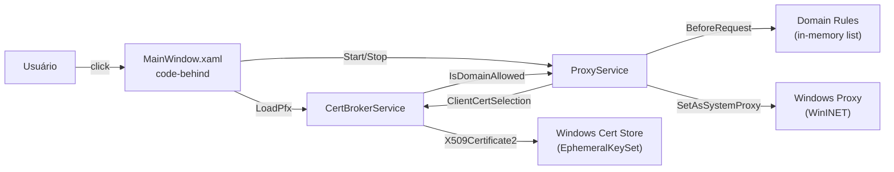
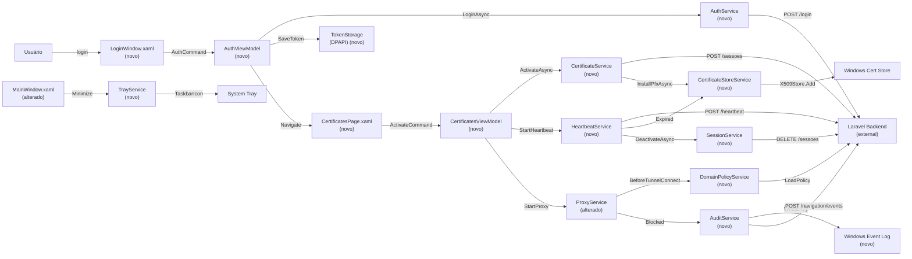

# SPEC: certguard-desktop-migration

## Metadata
- Source: developer description via /plan
- Service: CertGuard Desktop (.NET 8 WPF)
- Tier: complete
- Version: 1.0
- Architecture references: AGENTS.md, docs/agents/architecture.md, docs/agents/tech_stack.md, docs/agents/domain_rules.md, docs/agents/api_contracts.md, docs/agents/data_model.md, docs/agents/dependencies.md

## Summary

Migrate CertGuard Desktop from the current Electron/React/TypeScript stack to a .NET 8 WPF desktop application, building on the existing CertGuardMini prototype. The migration replaces a single-project code-behind WPF prototype with a multi-project solution (Core, Services, Desktop) using MVVM architecture, integrating with a Laravel backend for authentication, certificate lifecycle management, session heartbeat, MITM proxy with domain policy enforcement, and multi-layer audit logging.

## Context

CertGuardMini is currently a standalone WPF prototype with code-behind architecture (no MVVM, no backend API integration). It implements an in-memory certificate lifecycle, Titanium.Web.Proxy MITM interception on port 8888, hardcoded domain rules, and a block page. The migration targets a production-ready desktop client that authenticates against a Laravel Sanctum API, manages certificate sessions with PFX injection into the Windows certificate store, enforces domain-level access policies via wildcard matching, and syncs audit events to both Windows Event Log and the backend. The current prototype has no test framework, no dependency injection, and no persistence — all state is lost on application close.

## AS IS — Estado atual

**Legenda:** Diagrama de fluxo do estado atual do CertGuardMini. O usuário interage diretamente com MainWindow (code-behind), que orquestra CertBrokerService para carregamento de certificados e ProxyService para interceptação MITM. As regras de domínio são avaliadas em memória. Não existe integração com backend, MVVM, nem persistência de dados.

## TO BE — Estado proposto

**Legenda:** Diagrama de fluxo do estado proposto. A aplicação migra para MVVM com CommunityToolkit.Mvvm (RF-01). O login autentica contra o backend Laravel via AuthService e armazena o token com DPAPI (RF-02). A lista de certificados é exibida a partir da API com ativação/desativação (RF-03). O heartbeat roda como BackgroundService com limpeza automática na expiração (RF-04). O proxy MITM intercepta HTTPS, bloqueia domínios não autorizados e injeta client certificates (RF-05). A política de domínios suporta wildcard matching (RF-06). Os eventos de auditoria são logados no Windows Event Log e sincronizados com o backend (RF-07). A integração com system tray implementa minimização para a bandeja (RF-08).

## Scope
- **In**: Multi-project solution structure (Core, Services, Desktop), MVVM architecture with dependency injection, Laravel backend integration for auth/certs/sessions, DPAPI token persistence, MITM proxy with Titanium.Web.Proxy, domain policy with wildcard matching, certificate store install/remove, heartbeat BackgroundService, Windows Event Log audit, backend audit sync, system tray integration, Portuguese (pt-BR) UI strings
- **Out**: API Hooking (Camada 2 de auditoria — C++ N-API addon), SACL configuration, Sysmon integration, CNG ETW tracing, Detours/Hooks project, E2E test suite, production certificate deployment, Firefox proxy configuration, multi-user support, dashboard/Filament UI

## RIGID (Non-Negotiable)

### Functional Requirements

- RF-01 [State-Driven]: The solution SHALL contain three compilable projects — CertGuard.Core (Models, DTOs, Interfaces), CertGuard.Services (business logic), and CertGuard.Desktop (WPF application) — with correct inter-project references (Desktop references Services and Core; Services references Core).
  - AC: `dotnet build` from the solution root completes with zero errors and produces CertGuardDesktop.exe output.

- RF-02 [Event-Driven]: The login flow SHALL authenticate via `POST /api/desktop/login` to the Laravel backend, receive a Sanctum bearer token, and persist it using `System.Security.Cryptography.ProtectedData.ProtectedData.Protect` with `DataProtectionScope.CurrentUser` and entropy `CertGuard-v1`. On subsequent launches, the token SHALL be restored from DPAPI storage.
  - AC: Given valid credentials, the login screen transitions to the certificates page and the token is retrievable from DPAPI storage after application restart.

- RF-03 [Event-Driven]: The certificate list SHALL be fetched from `GET /api/desktop/certificados` using the authenticated session, display each certificate's apelido, empresa, status, and data_vencimento, and support activation (via `POST /api/desktop/sessoes`) and deactivation (via `DELETE /api/desktop/sessoes/{session_id}`) actions.
  - AC: After login, the certificates page displays at least one certificate from the API; clicking "Ativar" triggers session activation and certificate store installation; clicking "Desativar" removes the certificate from the store and ends the session.

- RF-04 [Event-Driven]: A `HeartbeatService` running as `Microsoft.Extensions.Hosting.BackgroundService` SHALL send `POST /api/desktop/heartbeat` every 30 seconds with the active session_id. When the response status is `"expired"` or `"revoked"`, the service SHALL remove the certificate from the Windows store via `X509Store.Remove()` and deactivate the session via `DELETE /api/desktop/sessoes/{session_id}`.
  - AC: Given an active session, the heartbeat fires within 30 ± 2 seconds; when the backend returns `status: "expired"`, the certificate is removed from the store and the session is deactivated within 5 seconds.

- RF-05 [Event-Driven]: The MITM proxy SHALL intercept HTTPS traffic using Titanium.Web.Proxy's `ProxyServer` on a configurable port, decrypt SSL for domains matching the cert-usage and validation lists, inject the client certificate via `ClientCertificateSelectionCallback` for cert-usage domains, and return an HTML block page for blocked domains.
  - AC: When the proxy is running, HTTPS requests to a blocked domain return the block page HTML with HTTP 200; requests to a cert-usage domain include the client certificate in the TLS handshake; requests to non-intercepted domains pass through as a raw tunnel.

- RF-06 [Conditional]: The domain policy service SHALL support wildcard matching using the `*.domain.tld` pattern for three lists: cert-usage domains (where client certificate is injected), validation domains (OCSP/CRL, allowed without interception), and blocked domains (return block page). A domain matches a wildcard pattern if it ends with the suffix after `*` (case-insensitive).
  - AC: Given a cert-usage rule `*.receita.fazenda.gov.br`, requests to `www.receita.fazenda.gov.br` and `api.receita.fazenda.gov.br` are intercepted with client cert; `receita.fazenda.gov.br` (exact, no subdomain) is not intercepted; `evil.receita.fazenda.gov.br` is intercepted.

- RF-07 [Event-Driven]: Audit events (blocked access, certificate injection, navigation violations) SHALL be logged to the Windows Event Log under source `"CertGuard"` using `System.Diagnostics.EventLog.WriteEntry` and simultaneously synced to the Laravel backend via `POST /api/desktop/navigation/events` with event_type, process_name, target_domain, action_taken, and detection_layer fields.
  - AC: When a domain is blocked, an event appears in the Windows Event Log with source "CertGuard" and the blocked domain; within 10 seconds, a corresponding record is created via `POST /api/desktop/navigation/events`.

- RF-08 [Event-Driven]: The application SHALL integrate with the Windows system tray using `Hardcodet.Wpf.TaskbarNotification`. When the main window is minimized, it SHALL hide from the taskbar and appear only as a tray icon. Double-clicking the tray icon SHALL restore the window. The tray icon context menu SHALL offer "Abrir" (restore) and "Sair" (exit) options.
  - AC: Minimizing the window hides it from the taskbar and shows a tray icon; double-clicking the tray icon restores the window; right-clicking shows "Abrir" and "Sair" options; "Sair" terminates the application.

- RF-09 [Event-Driven]: Device registration SHALL be performed via `POST /api/desktop/devices` with hostname, IP address, OS info, fingerprint, and public key. The device fingerprint SHALL be a SHA-256 hash of the machine's hostname + MAC address. Registration occurs before the first certificate activation and is idempotent.
  - AC: On first activation, the device is registered and a device_id is returned; on subsequent activations, the existing device_id is reused without creating a duplicate record.

- RF-10 [Event-Driven]: The certificate store service SHALL install PFX bytes received from the session activation response into the Windows `X509Store` (CurrentUser\My) using `X509Certificate2(pfxBytes, password, PersistKeySet | Exportable)` and remove certificates by thumbprint using `X509Store.Remove()`.
  - AC: After session activation, a certificate with the expected thumbprint exists in `X509Store(StoreName.My, StoreLocation.CurrentUser)`; after deactivation, no certificate with that thumbprint exists in the store.

- RF-11 [Event-Driven]: The key generation service SHALL generate RSA 2048-bit key pairs using `RSA.Create(2048)` and persist the private key encrypted with `ProtectedData.Protect` (DPAPI, CurrentUser scope, entropy `CertGuard-v1`). The public key is sent to the backend during device registration.
  - AC: `GenerateKeyPairAsync()` returns a non-empty public key in PEM format and a non-empty encrypted private key blob; the public key is extractable without DPAPI decryption; the private key is only recoverable via `ProtectedData.Unprotect` on the same user profile.

- RF-12 [Conditional]: The navigation policy service SHALL fetch domain lists from `GET /api/desktop/navigation/policy?session_id={session_id}` and load them into the DomainPolicyService. The response contains `cert_usage_domains`, `validation_domains`, and `blocked_domains` arrays. The policy is fetched once on session activation and cached in memory.
  - AC: After session activation, `DomainPolicyService.IsAllowedForInterception("*.receita.fazenda.gov.br")` returns true if the backend returned that pattern in `cert_usage_domains`.

- RF-13 [Event-Driven]: When a session's remaining time drops below 300 seconds (5 minutes), the application SHALL display an expiry warning dialog showing the countdown. The dialog SHALL offer "Estender" (extend, re-activate) and "Encerrar" (close, deactivate) actions. The countdown updates every 1 second via a `DispatcherTimer`.
  - AC: With a session TTL of 60 minutes, the expiry dialog appears at 55 minutes remaining; the countdown decrements every second; clicking "Encerrar" deactivates the session and removes the certificate.

### Contracts

- CT-01: `POST /api/desktop/login` — Request: `{ email: string, password: string }` → Response 201: `{ token: string, user: { id: int, name: string, email: string } }` → Response 422: `{ message: string, errors: { email: string[] } }`
- CT-02: `POST /api/desktop/logout` — Header: `Authorization: Bearer {token}` → Response 200: `{ message: "Logged out" }`
- CT-03: `GET /api/desktop/me` — Header: `Authorization: Bearer {token}` → Response 200: `{ id: int, name: string, email: string }`
- CT-04: `POST /api/desktop/devices` — Header: `Authorization: Bearer {token}` → Request: `{ hostname, ip_address, so, fingerprint, public_key }` → Response 201: `{ device_id: int, fingerprint: string, is_active: bool }`
- CT-05: `GET /api/desktop/devices` — Header: `Authorization: Bearer {token}` → Response 200: `{ devices: [{ id, hostname, ip_address, so, fingerprint, is_active, last_seen_at }] }`
- CT-06: `DELETE /api/desktop/devices/{device_id}` — Header: `Authorization: Bearer {token}` → Response 200: `{ success: true }`
- CT-07: `GET /api/desktop/certificados` — Header: `Authorization: Bearer {token}` → Response 200: `{ certificados: [{ id, apelido, empresa, cnpj, status, data_vencimento, requires_justification, session_ttl_minutes, allowed_weekdays, allowed_time_start, allowed_time_end }] }`
- CT-08: `POST /api/desktop/sessoes` — Header: `Authorization: Bearer {token}` → Request: `{ certificado_id: int, device_id: int, justification?: string }` → Response 201: `{ session_id, session_code, certificado_id, cnpj, common_name, expires_at, pfx_base64, pfx_password }`
- CT-09: `POST /api/desktop/heartbeat` — Header: `Authorization: Bearer {token}` → Request: `{ session_id: string }` → Response 200: `{ status: "active"|"expired"|"revoked", expires_at: string|null }`
- CT-10: `DELETE /api/desktop/sessoes/{session_id}` — Header: `Authorization: Bearer {token}` → Response 200: `{ success: true }`
- CT-11: `GET /api/desktop/navigation/policy` — Header: `Authorization: Bearer {token}` → Query: `?session_id={session_id}` → Response 200: `{ policy_id, mode, violation_action, cert_usage_domains: string[], validation_domains: string[], blocked_domains: string[] }`
- CT-12: `POST /api/desktop/navigation/events` — Header: `Authorization: Bearer {token}` → Request: `{ session_id, event_type, timestamp, process_name, process_id, certificate_thumbprint, target_domain, action_taken, detection_layer, metadata }` → Response 201: `{ id: int }`

### Non-Functional Requirements

- RNF-01: Certificate private keys SHALL remain in memory only — PFX loaded with `X509KeyStorageFlags.EphemeralKeySet` (for proxy/prototype use) or `PersistKeySet` (for Windows store installation). Private keys SHALL NOT be written to disk outside the Windows certificate store.
- RNF-02: The heartbeat interval SHALL be 30 ± 2 seconds between consecutive `POST /api/desktop/heartbeat` calls while a session is active.
- RNF-03: All user-facing UI strings SHALL be in Portuguese (Brazilian) — pt-BR.
- RNF-04: The application SHALL target .NET 8.0-windows (`net8.0-windows`) and compile with nullable reference types enabled and implicit usings enabled.
- RNF-05: The MITM proxy SHALL listen on a configurable port (default 8888) and SHALL NOT hardcode the port number — the port SHALL be read from the `ProxyService.Port` property.

## FLEXIBLE (Implementation Suggestions)

- Use CommunityToolkit.Mvvm `ObservableObject` and `[ObservableProperty]` / `[RelayCommand]` source generators for ViewModels.
- Use `Microsoft.Extensions.DependencyInjection` for service registration and `IHost` / `Host.CreateApplicationBuilder` for application lifecycle.
- Use `Microsoft.Extensions.Http` `IHttpClientFactory` with a named client `"backend"` configured with base address `https://homolog.lidderaplus.com.br/api`.
- Use an `AuthHandler : DelegatingHandler` to attach the Bearer token from `TokenStorage` to all outgoing requests.
- Use `Serilog` with `Sinks.File` for local debug logging and a `SensitiveDataEnricher` to redact tokens, passwords, and private keys from log output.
- Use `Titanium.Web.Proxy` 3.2.0 (same version as prototype) for MITM interception.
- Use `Hardcodet.Wpf.TaskbarNotification` NuGet package for system tray icon.
- Private fields: `_camelCase` prefix convention; public members: PascalCase.
- File-scoped namespaces: `namespace CertGuardDesktop;` syntax.
- Collection expressions: `[]` syntax for list initialization.
- Async methods: suffix with `Async` (e.g. `LoginAsync`).

## Acceptance Criteria Summary

| ID | Criterion | Testable? |
|----|-----------|-----------|
| AC-01 | Solution with Core, Services, Desktop projects compiles successfully (`dotnet build` zero errors) | Yes |
| AC-02 | Login authenticates via POST /api/desktop/login, stores token with DPAPI, token persists across restarts | Yes |
| AC-03 | Certificate list displays from GET /api/desktop/certificados; activation triggers POST /api/desktop/sessoes + store install; deactivation triggers DELETE /api/desktop/sessoes + store remove | Yes |
| AC-04 | Heartbeat fires every 30 ± 2s; on expired/revoked response, certificate removed from store and session deactivated within 5s | Yes |
| AC-05 | Proxy on port 8888 intercepts HTTPS; blocked domains return block page; cert-usage domains get client cert injection; non-intercepted domains pass as tunnel | Yes |
| AC-06 | Wildcard `*.domain.tld` matches subdomains but not bare domain; case-insensitive matching | Yes |
| AC-07 | Blocked event appears in Windows Event Log with source "CertGuard"; POST /api/desktop/navigation/events created within 10s | Yes |
| AC-08 | Minimize hides from taskbar, shows tray icon; double-click restores; right-click shows "Abrir"/"Sair"; "Sair" exits | Yes |
| AC-09 | Device registered via POST /api/desktop/devices on first activation; idempotent on subsequent activations | Yes |
| AC-10 | PFX installed into X509Store after activation; removed by thumbprint after deactivation | Yes |
| AC-11 | RSA 2048 key pair generated; private key encrypted with DPAPI; public key extractable | Yes |
| AC-12 | Domain policy fetched from GET /api/desktop/navigation/policy on activation; wildcard matching applied in DomainPolicyService | Yes |
| AC-13 | Expiry dialog appears at 5 minutes remaining; countdown updates every second; "Encerrar" deactivates session | Yes |

## Risks

| Risk | Severity | Mitigation |
|------|----------|------------|
| Backend API endpoints not yet implemented in Laravel | High | Mark RF-09, RF-12 as FLEXIBLE; use mock responses during development |
| Firefox does not respect Windows system proxy settings | Medium | Document manual proxy configuration or GPO for Firefox users |
| X509Store behavior differences across Windows 10/11 versions | Medium | Test on both Windows 10 22H2 and Windows 11 23H2 before release |
| Titanium.Web.Proxy root certificate installation requires admin privileges | Medium | Document requirement to run as Administrator; catch and display clear error message |
| DPAPI scope limited to same user profile and machine | Low | Document that token cannot be transferred across machines by design |
